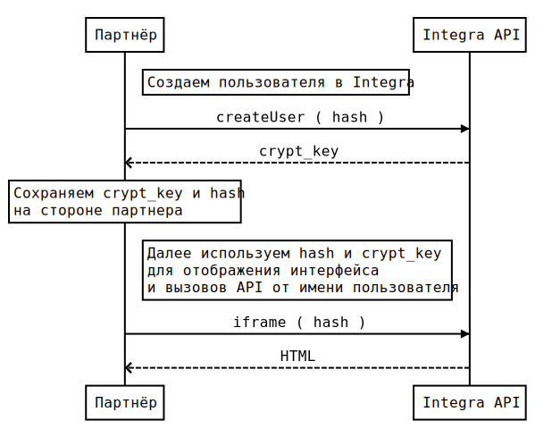

Руководство по интеграции модуля 
================================

Информация, представленная в документе, актуальна для API версии 1 сервиса SP Integra 3.x.

Содержание
----------

* [Формат взаимодействия](#формат-взаимодействия)
* [Шифрование данных](#шифрование-данных)
* [Регистрация пользователя и получение доступа](#регистрация-пользователя-и-получение-доступа)
* [IFrame](#iframe)
* [Дополнительные материалы](#дополнительные-материалы)


<a name="формат-взаимодействия"></a>

Формат взаимодействия
---------------------

Запросы к API выполняются по протоколу HTTPS методами GET или POST. 
Все данные, необходимые для вызова метода API, находятся в PATH-части URL запроса. 

В общем виде запрос к API выгялядит так:

`GET https://<HOST>/<PARTNER_PATH>/<METHOD>?k=<PREFIX><IDENTITY_HASH><DATA>`

где  

`<HOST>` — адрес сервера API  
`<PARTNER_PATH>` — уникальный путь Партнера  
`<METHOD>` — название вызываемого метода  
`<PREFIX>` — строка, идентифицирующая алгоритм шифрования (всегда `kaa`)  
`<IDENTITY_HASH>` — уникальный 32-х символьный hash, идентифицирующий пользователя или партнера  
`<DATA>` — аргументы вызываемого метода в виде строки JSON зашифрованной алгоритмом симметритчного шифрования (см. раздел [Шифрование данных](#шифрование-данных)) 

Использование API предполагает два контекста вызываемых методов: 
 * контекст общего действия (сразу над несколькими пользователями или вообще никак не связанного с пользователями)
 * контекст действия пользователя

Например, получение списка пользователей это общее действие, а пополнение счета — пользовательское.

В зависмости от контекста вызываемого метода для подготовки запроса требуются разные пары `hash` и `cryptKey`. 
Для вызовов методов общих действий используются `hash` и `cryptKey` Партнера, а для операций с пользователем — `hash` и `cryptKey`, полученные при регистрации пользователя.

Пример вызова API на PHP (см. файл [examples/example-hello.php](examples/example-hello.php)):

```php
/* Подготавливаем URL */

$dataJson = json_encode([
  'name' => 'Dmitry'
]);

// Для вызова данного метода используем hash и cryptKey Партнера
$hash = getenv('__PARTNER_HASH__');
$cryptKey = getenv('__PARTNER_KEY__');

$data = Crypt::encrypt($dataJson, $cryptKey);

$url = 'https://sandbox.seopult.org/iframe/hello?k=zaa' . $hash . urlencode($data);


/* Вызываем API */

$streamContext = stream_context_create([
  'http' => [
    'method' => 'GET',
    'header' => "Content-type: application/json\r\n"
  ]
]);

$response = file_get_contents($url, false, $streamContext);

var_dump($response);

/*
{ 
  status: {
    code: 0, 
    message: "ok" 
  }, 
  error: false, 
  data: "Hello, Dmitry!" 
}
*/

```

<a name="шифрование-данных"></a>

Шифрование данных
-----------------
Для безопасной работы по протоколу HTTP используется смметричное шифрование данных.
 
Алгоритм шифрования уникальный для каждого партнера. При интеграции мы предоставим исходный код класса, 
реализующий следующий интерфейс шифрования (см. файл [examples/crypt.php](examples/crypt.php)):   

```php
interface CryptInterface {
   public static function encrypt(string $string, string $key): string;
   public static function decrypt(string $string, string $key): string;
}
```

<a name="регистрация-пользователя-и-получение-доступа"></a>

Регистрация пользователя и получени доступа
-------------------------------------------

Для того чтобы получить доступ к веб-интерфейсу сначала необходимо зарегистрировать пользователя в __Integra__.

Регистрация осуществляется путем вызова API-метода `createUser`, который принимает на вход два обязательных параметра: `hash` и `username`. 
В случае успешной регистрации `createUser` в ответе вернет `cryptKey`, который следует сохранить на стороне Партнера, т.к. в дальнейшем этот ключ будет использоваться сервером для расшифровки параметров вызова API в контексте пользователя.   
 
Диаграмма последовательности регистрации пользователя:




<a name="iframe"></a>

IFrame
------

Веб-интерфейс модуля продвижения встраивается в веб-страницу Партнера используя HTML-элемент `<iframe>`.

HTML-код `<iframe>` генерируется динамически на стороне Партнера, атрибут `src` содержит уникальный для каждого пользователя URL. 

```html
<html>
    <!-- ... -->
    <iframe src="{уникальный-url-пользователя}"></iframe>
    <!-- ... -->
</html>
``` 

Для формирования URL используется следующий синтаксис: 

`https://<HOST>/<PARTNER_PATH>/iframe?k=<PREFIX><HASH><DATA>`

где

`<HOST>` — адрес сервера API  
`<PARTNER_PATH>` — уникальный путь, индивидуальный для каждого партнера  
`<PREFIX>` — строка, идентифицирующая алгоритм шифрования (всегда `kaa`)  
`<HASH>` — уникальная 32-х символьная строка, идентифицирующий пользователя  
`<DATA>` — дополнительные параметры в зашифрованом виде  


<a name="дополнительные-материалы"></a>

Дополнительные материалы 
------------------------
* [Пополнение счета](#пополнение-счёта)
* [API Уведомлений](#api-уведомлений)
* [API технической поддержки](#api-технической-поддержки)
