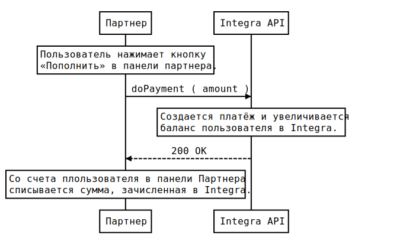
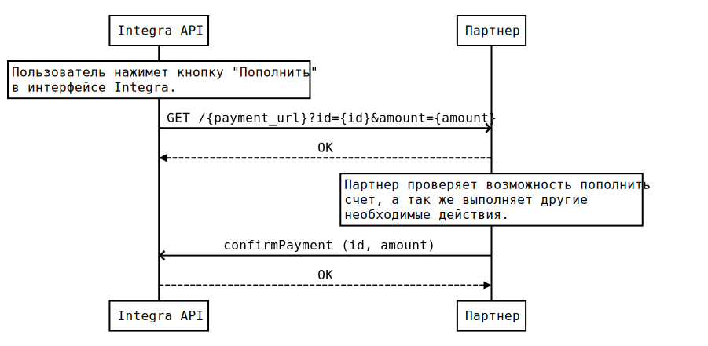

# Финансовое взаимодействие

Раздел находится в стадии наполнения, информация может быть неактуальной.

## Содержание

* [Прямое создание платежа](#прямое-создание-платежа)
* [Пополнение со счета Партнера](#пополнение-со-счета-партнера)
* [Пополнение через встроенный эквайринг (Робокасса)](#пополнение-через-встроенный-эквайринг)
* [Возврат средств](#возврат-средств)

## Прямое создание платежа

Пополнение происходит путем вызова API-метод `doPayment`. Зачисление средств происходит немедленно и не требует дополнительного подтверждения.  

Ниже представлена диаграмма последовательности пополнения счёта через Прямое создание платежа:

## Пополнение со счета Партнера

После нажатия Пользователем кнопки Пополнить (в интерфейсе Integra) платформа
создает неподтвержденный платеж и делает GET-запрос на `PAYMENT_NOTIFY_URL` указанный при логине через API-метод 
`cryptLogin` (см. разделы [Авторизация пользователя](API-v1-reference.md#Авторизация) и [Шаблон PAYMENT_NOTIFY_URL](API-v1-reference.md#шаблон-payment_notify_url)). 

После получения уведомления Партнеру следует сделать необходимые проверки на возможность списания средств со счета и в 
случае положительного результата вызвать метод `confirmPayment` с необходимыми параметрами. В случае невозможности 
пополнить счет вызывается метод `declinePayment` с кодом ошибки, описанием причины её возникновения и дополнительными 
необязательными параметрами (см. раздел [Отклонение платежа пользователя](API-v1-reference.md#Отклонение-платежа-пользователя)).    

Ниже представлена диаграмма последовательности Пополнения со счета Партнер:

## Пополнение через встроенный эквайринг

При использовании встроенного эквайринга никаких действий по интеграции не требуется. Пользователь нажимает кнопку 
пополнить внутри интерфейса Integra и попадает в окно выбора вариантов пополенения Робокассы, совершает платеж и через 
короткое время, после подтверждения платежа Робокассой, обновляется баланс внутри Integra.

## Возврат средств

Возврат средств осуществляется путем вызова API-метода `doPayment` с отрицательной суммой пополнения.